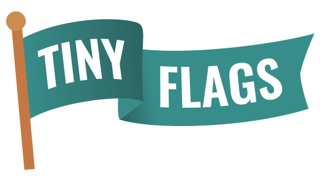

## 🚩 What is this? Feature flags for ants?

Well, yes! [Antiny 🐜](./assets/antiny.png) looks super happy with it. But also it is a simple way to add client-side feature flags that can be updated at runtime using a companion browser extension.

Let PMs, designers, fellow developers or even clients try your awesome new features without worrying about waiting for the whole thing to be finished or blocking a release.

Tiny Flags is a great option when you don't want to pay for a third-party provider. Every user of your application can update the flags' status without the need of re-deploying, allowing them to test in a real environment.

This project also provides full TypeScript support when using the `useFlags` hook.

## 📦 Install

```sh
npm i @matiasbontempo/tiny-flags
```

## 🧑‍💻 Usage

First, you'll need a configuration:

```js
// tiny-flags.ts

import { createTinyFlags } from 'tiny-flags';

const flags = {
  newFeature: {
    label: 'New Feature',
    value: false, // value is not required
  },
  anotherFlag: {
    label: 'This is another feature enabled by default',
    value: true,
  },
};

export const { FlagsProvider, useFlags } = createTinyFlags(flags);
```

Then you can wrap your application with FlagsProvider.

```js
import ReactDOM from 'react-dom/client';
import App from './App';

import { FlagsProvider } from './tiny-flags';

ReactDOM.render(
  <React.StrictMode>
    <FlagsProvider><App /></FlagsProvider>
  </React.StrictMode>,
  document.getElementById('root')
)
```

Finally, import `useFlags` in your components to check your flag's status.

```js
// component.ts

import { useFlags } from './tiny-flags';

const App = () => {
  const flags = useFlags();

  return (
    <div>
      This will show if
      { flags.newFeature && <div>Ta-da! 🎉</div> }
    </div>
  );
};

export default App;
```

> Make sure to import `FlagsProvider` and `useFlags` from the `tiny-flags` configuration file and not the `tiny-flags` package. 

## 🧩 Extension

This library establishes a two-way communication with the Tiny Flags Extension so you can see the available flags and also toggle their state.


## ⚠️ When not to use?
- You need to remotely update your flags
- You need complex rules or different audiences for your flags
- You don't want your flags to be exposed
